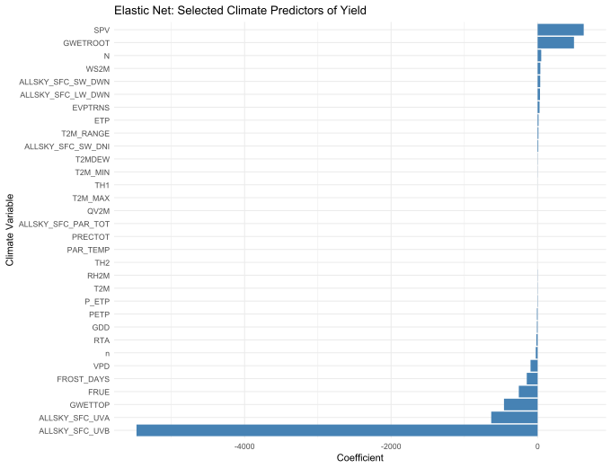
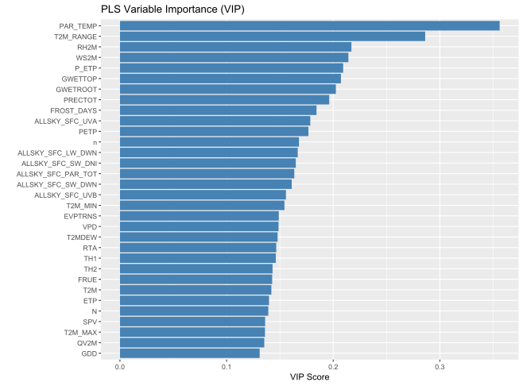
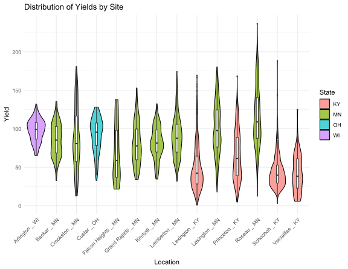
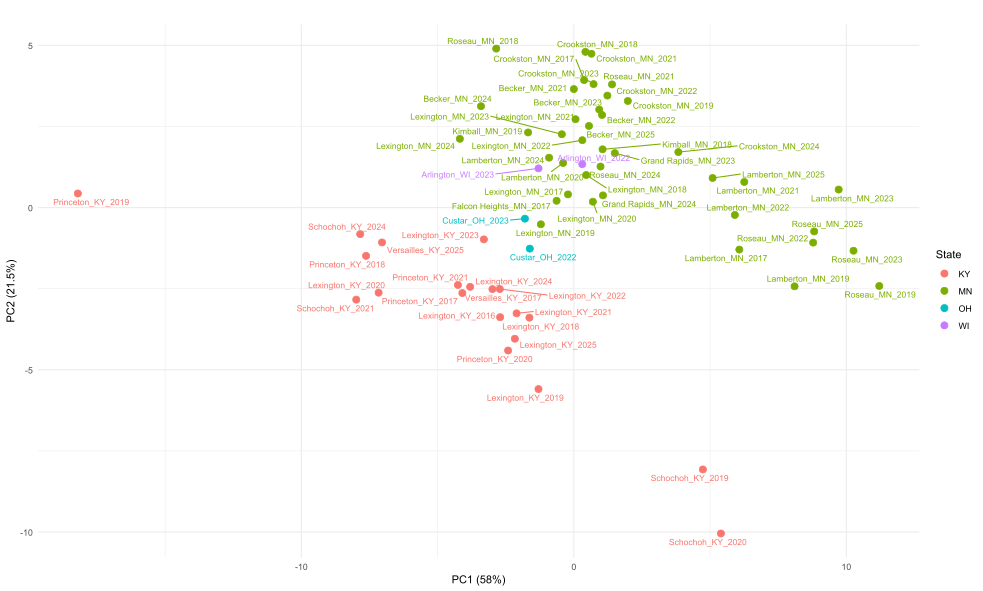
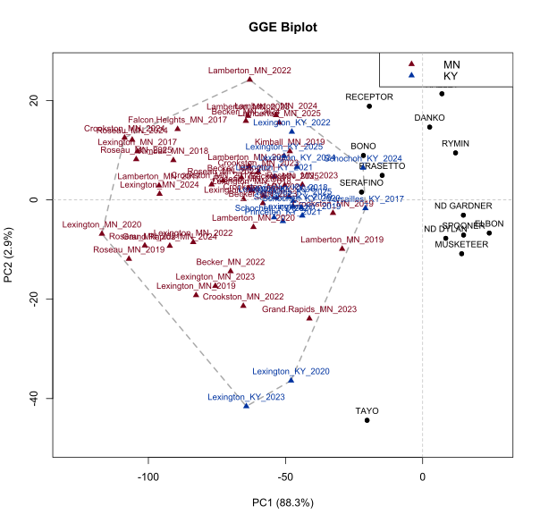

### Environmental Influences and Genotype × Environment Interactions Governing Cereal Rye Yields in Kentucky

Poster presented at the Eastern Wheat Workers Meeting   
April 20th 2026

### Have Rye yield data that you can share?
Please help us understand rye's adaptation to our region by sharing data from any rye trials along with planting and harvest dates, GPS locations, and any management information. 

Please email me to discuss: fabian.leon@uky.edu

### Further Poster Details:

Figure 1. Climate predictors were selected using an elastic net regression implemented in the glmnet package in R, where yield was modeled as a function of all candidate environmental variables after removal of excluded covariates and observations with missing data; predictors were standardized, and model tuning was performed via cross-validation with α = 0.5, with coefficients extracted at the λ₁se penalty to identify the most robust variables associated with yield.

Figure 2. Variable importance was quantified using partial least squares regression (PLS) implemented in R, where standardized environmental predictors were used to model yield after removal of incomplete observations; a three-component model was fit, and variable importance in projection (VIP) scores were calculated from component weights and the proportion of response variance explained, with variables ranked based on their contribution to yield prediction.

Figure 3. Violin plots showing the distribution in grain yield for aggregated rye trial data by location (city).

Figure 4. An enviromics analysis was conducted by aggregating climate variables to the environment level and performing principal component analysis (PCA) on scaled, variance-filtered environmental covariates using R; environment scores were extracted from the PCA, joined with state metadata, and visualized in the first two principal components to characterize climatic structure among trial environments.

Figure 5. A genotype-by-environment interaction analysis was conducted using mean yield data aggregated by variety and environment, retaining genotypes and environments meeting minimum trial representation thresholds, and fitting a GGE biplot using the metan package in R; genotype and environment scores were extracted from the first two principal components and visualized to assess patterns of yield performance and environmental differentiation.

-------------------
Table 1. A linear model was fit in R to evaluate yield as a function of variety and selected environmental covariates, including temperature, radiation, humidity, soil moisture, and evapotranspiration variables, and model significance was assessed using analysis of variance (ANOVA).

-------------------
Table 2. Summary of the aggregated data and the number of locations varieties 

| State | Year | Dataset        | Locations | Varieties |
|-------|------|----------------|-----------|-----------|
| KY    | 2016 | KY_Variety     | 1         | 12        |
| KY    | 2017 | KY_Management  | 1         | 4         |
| KY    | 2017 | KY_Variety     | 1         | 12        |
| KY    | 2018 | KY_Management  | 1         | 1         |
| KY    | 2018 | KY_Variety     | 1         | 16        |
| KY    | 2019 | KY_Breeding    | 1         | 24        |
| KY    | 2019 | KY_Breeding_PD | 2         | 24        |
| KY    | 2019 | KY_Management  | 1         | 1         |
| KY    | 2019 | KY_Variety     | 1         | 17        |
| KY    | 2020 | KY_Breeding_PD | 2         | 23        |
| KY    | 2020 | KY_Management  | 1         | 2         |
| KY    | 2020 | KY_Variety     | 1         | 13        |
| KY    | 2021 | KY_Breeding    | 3         | 24        |
| KY    | 2021 | KY_Management  | 1         | 1         |
| KY    | 2021 | KY_Variety     | 1         | 11        |
| KY    | 2022 | KY_Variety     | 1         | 13        |
| KY    | 2022 | OH_Management  | 1         | 1         |
| KY    | 2023 | KY_Variety     | 1         | 11        |
| KY    | 2023 | OH_Management  | 1         | 1         |
| KY    | 2024 | KY_Breeding    | 2         | 19        |
| KY    | 2024 | KY_Variety     | 1         | 14        |
| KY    | 2025 | KY_Breeding    | 2         | 11        |
| KY    | 2025 | KY_Variety     | 1         | 11        |
| MN    | 2017 | MN_Variety     | 4         | 17        |
| MN    | 2018 | MN_Variety     | 4         | 18        |
| MN    | 2019 | MN_Variety     | 5         | 18        |
| MN    | 2020 | MN_Variety     | 2         | 20        |
| MN    | 2021 | MN_Variety     | 5         | 15        |
| MN    | 2022 | MN_Variety     | 5         | 16        |
| MN    | 2022 | OH_Management  | 2         | 1         |
| MN    | 2023 | MN_Variety     | 6         | 14        |
| MN    | 2023 | OH_Management  | 1         | 1         |
| MN    | 2024 | MN_Variety     | 6         | 14        |
| MN    | 2025 | MN_Variety     | 3         | 14        |
| OH    | 2022 | OH_Management  | 1         | 1         |
| OH    | 2023 | OH_Management  | 1         | 1         |
| WI    | 2022 | OH_Management  | 1         | 1         |
| WI    | 2023 | OH_Management  | 1         | 1         |

-------------------

Table 3. Summary of varieties that occur in the aggregated dataset. 

| Variety            | Environments | States | Years |
|--------------------|--------------|--------|-------|
| HAZLET             | 52           | 2      | 9     |
| SERAFINO           | 51           | 2      | 8     |
| RYMIN              | 45           | 2      | 9     |
| TAYO               | 44           | 4      | 7     |
| DANKO              | 40           | 2      | 8     |
| ELBON              | 39           | 2      | 7     |
| ND DYLAN           | 39           | 2      | 8     |
| BRASETTO           | 34           | 2      | 6     |
| SPOONER            | 34           | 2      | 9     |
| RECEPTOR           | 31           | 2      | 5     |
| BONO               | 27           | 2      | 5     |
| ND GARDNER         | 27           | 1      | 6     |
| MUSKETEER          | 25           | 1      | 6     |
| AROOSTOOK          | 18           | 2      | 8     |
| REMINGTON          | 18           | 1      | 4     |
| SU COSSANI         | 18           | 2      | 4     |
| SU PERFORMER       | 18           | 2      | 4     |
| PRIMA              | 15           | 1      | 4     |
| SU BEBOP           | 15           | 1      | 3     |
| SU PERSPECTIV      | 15           | 1      | 3     |
| H20003             | 14           | 2      | 3     |
| TREBIANO           | 14           | 2      | 3     |
| H20005             | 13           | 2      | 2     |
| CLAUDIUS           | 11           | 1      | 3     |
| WHEELER            | 11           | 2      | 4     |
| DANIELLO           | 10           | 2      | 4     |
| DOLARO             | 10           | 2      | 2     |
| GATANO             | 10           | 2      | 3     |
| KYSC1705           | 9            | 1      | 4     |
| AVENTINO           | 8            | 1      | 4     |
| LAX GUARDIAN       | 8            | 1      | 8     |
| KYSC1503           | 7            | 1      | 3     |
| KYSC1701           | 7            | 1      | 3     |
| KYSC1702           | 7            | 1      | 3     |
| KYSC1703           | 7            | 1      | 3     |
| KYSC1704           | 7            | 1      | 3     |
| KYSC1706           | 7            | 1      | 3     |
| KYSC1707           | 7            | 1      | 3     |
| KYSC1709           | 7            | 1      | 3     |
| KYSC1710           | 7            | 1      | 3     |
| SU KALYPTUS        | 7            | 1      | 2     |
| WRENZ ABRUZZI      | 7            | 1      | 3     |
| FRATELLO           | 6            | 2      | 1     |
| GILMOR             | 6            | 2      | 1     |
| H20004             | 6            | 2      | 1     |
| H241               | 6            | 1      | 1     |
| TULUS              | 6            | 1      | 2     |
| CCWRY1             | 5            | 1      | 5     |
| DREB15             | 5            | 1      | 1     |
| KYSC1710C1SP1      | 5            | 1      | 2     |
| OKLON              | 5            | 2      | 2     |
| SH-06              | 5            | 1      | 4     |
| WINTERGRAZER 70    | 5            | 1      | 2     |
| BINNTO             | 4            | 1      | 1     |
| GUTTINO            | 4            | 1      | 3     |
| MATON II           | 4            | 1      | 1     |
| PROGAS             | 4            | 1      | 1     |
| RAPTUS             | 4            | 1      | 1     |
| SH-03              | 4            | 1      | 3     |
| BERADO             | 3            | 2      | 1     |
| H247               | 3            | 1      | 1     |
| H249               | 3            | 1      | 1     |
| SH-05              | 3            | 1      | 3     |
| SU ERLING          | 3            | 1      | 1     |
| ABRUZZI            | 2            | 1      | 1     |
| BALBO              | 2            | 1      | 1     |
| BRAVEST            | 2            | 1      | 2     |
| FL401              | 2            | 1      | 1     |
| GUARDIAN           | 2            | 1      | 2     |
| GUVEST             | 2            | 1      | 2     |
| KYSC 1503C3        | 2            | 1      | 1     |
| KYSC 1701C1 SP1 BLK 1 | 2         | 1      | 1     |
| KYSC 1707C1        | 2            | 1      | 1     |
| KYSC 1710C1 SP1 BLK 2 | 2         | 1      | 1     |
| KYSC 1806C0        | 2            | 1      | 1     |
| KYSC1701C1SP1      | 2            | 1      | 1     |
| KYSC1707PRN        | 2            | 1      | 1     |
| KYSC1707SP         | 2            | 1      | 1     |
| KYSC1708           | 2            | 1      | 1     |
| KYSC1806C0         | 2            | 1      | 1     |
| MERCED             | 2            | 1      | 1     |
| NT12404-1          | 2            | 1      | 1     |
| PROGRAS            | 2            | 1      | 2     |
| SH-01              | 2            | 1      | 2     |
| SH-02              | 2            | 1      | 2     |
| SH05               | 2            | 1      | 1     |
| SH07               | 2            | 1      | 1     |
| SU FORSETTI        | 2            | 1      | 1     |
| SU LIBORIUS        | 2            | 1      | 1     |
| EXP H247           | 1            | 1      | 1     |
| EXP H249           | 1            | 1      | 1     |
| GALVANO            | 1            | 1      | 1     |
| GRAZEKING          | 1            | 1      | 1     |
| H241 DWARF         | 1            | 1      | 1     |
| H9008              | 1            | 1      | 1     |
| H9011              | 1            | 1      | 1     |
| KY RYE             | 1            | 1      | 1     |
| KY-501             | 1            | 1      | 1     |
| KY-502             | 1            | 1      | 1     |
| KY-503             | 1            | 1      | 1     |
| KYR1               | 1            | 1      | 1     |
| KYR2               | 1            | 1      | 1     |
| KYSC1503 C3        | 1            | 1      | 1     |
| KYSC1503C3         | 1            | 1      | 1     |
| MAGNIFICO          | 1            | 1      | 1     |
| SH-04              | 1            | 1      | 1     |
| SU MEPHISTO        | 1            | 1      | 1     |