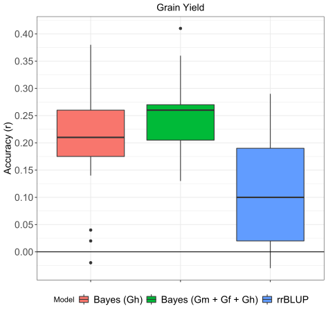
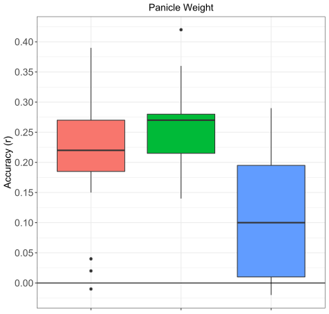
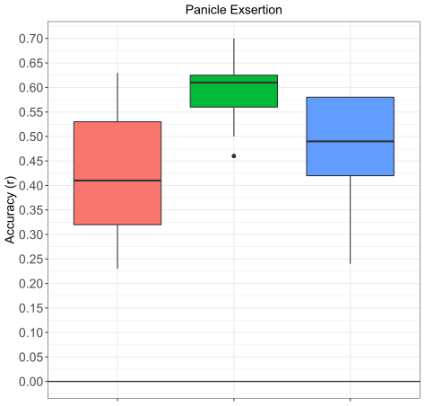
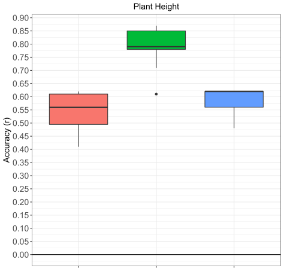
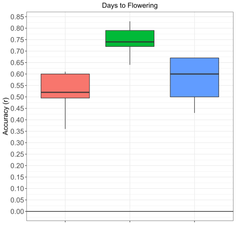
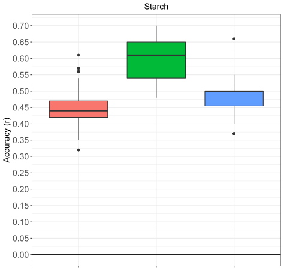
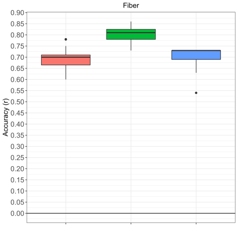
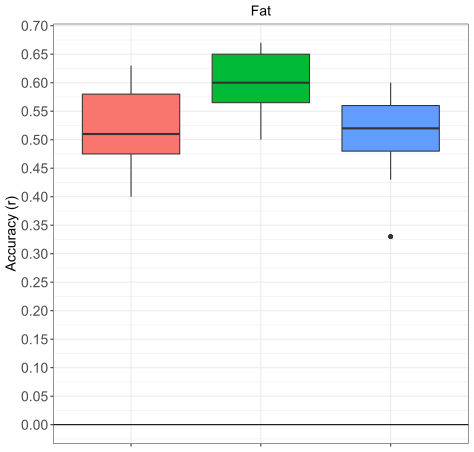
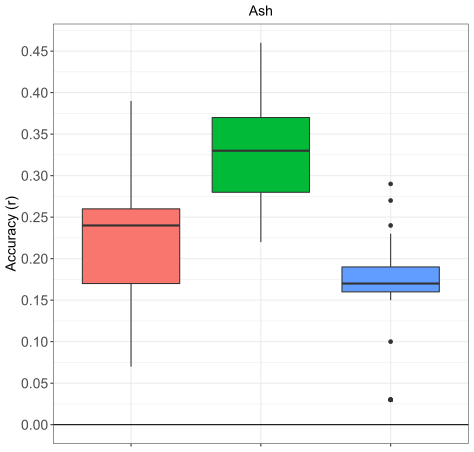
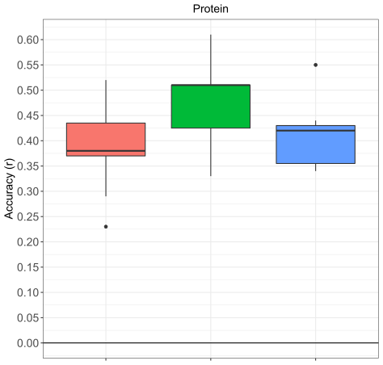

## Prediction Accuracies for genomic prediction models of grain sorghum traits

Grain Yield 

 

Test weight 

 

Panicle Weight 

 

Panicle Exsertion 

 

Plant Height 

  

Days to Mid Anthesis 

 

Percent Starch in Grain 

Percent Fiber in Grain 

Percent Fat in Grain 

Percent Ash in Grain 

Percent Protein in Grain 

